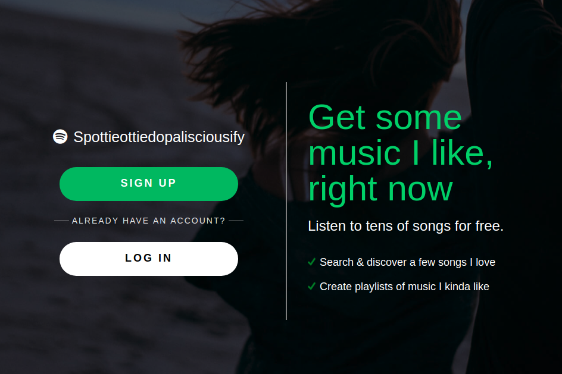
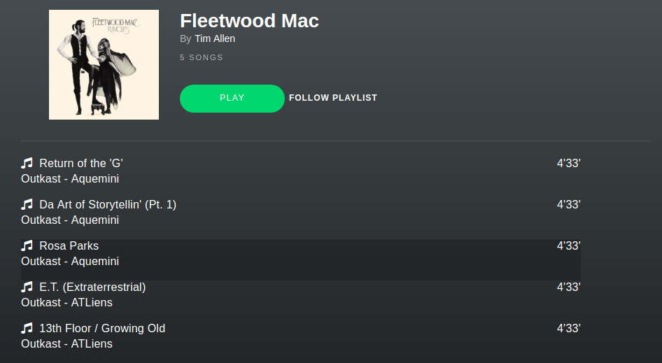

## [Spottieottiedopalisciousify](https://spottieottiedopalisciousify.herokuapp.com/)

A single page webapp clone of Spotify, featuring playist CRUD operations and
a continuously playing audioplayer. Spottieottiedopalisciousify is built with Rails, React, and Redux
and provides you with the ability to play 10s of your favorite songs (that are by Outkast(and from their second or third album)).



## PLAY YOUR FAVORITE SONGS
An HTML5 audio player was implemented via React and Redux allowing users to play all of their favorite songs from Outkast's second and third albums.  Custom styled HTML components where used with various event listeners to add functionality such as next and previous songs, fast forward and rewind, play and pause.

```javascript
<audio loop={false}
       autoPlay={this.props.playing}
       onLoadedData={this.fetchDuration}
       src={song}
       onEnded={this.next}
       ref={(audio) => this.audio = audio}
       onTimeUpdate={this.updateTime} />

```

Songs are placed in the Redux store via various methods when navigating the site, and the connected audioplayer component provides seamless music
playing capabilities as they navigate the site. Refs are used in a limited capacity to help manage the large amount of asynchronous functions
that would otherwise need to be used to handle continuous audio playing.

Redux was used to provide song playing capabilities, allowing users to listen to playlists or individual songs to the queue.
functionality is added via various actions and reducers which maintain the song queue and manage the currently playing song. Songs are stored
via active storage and AWS S3 buckets and are served up to the front end via Active Storage blobs.

```javascript
export default combineReducers({
  nowPlaying: nowPlayingReducer,
  songQueue: songQueueReducer,
  queueSelector: queueSelectorReducer,
});
```
## PLAYLIST CRUD



Users can create, edit, delete, and view playlists and can also follow other users created playlists. Playlists are tied to the user who
created them via active record associations and can have songs added or removed, and can be followed by other users providing convenient access on the users profile page. Playlists are rendered via connected components that pull the relevant association information from the back end via the Redux store.

```javascript
const mapStateToProps = (state, ownProps) => {
  const playlist = selectPlaylist(state, ownProps.match.params.playlistid);
  const songs = selectPlaylistSongs(state, playlist);
  let follows = false;
  state.entities.users[state.session.id].followed_playlists.map(pl => {
    if (pl.id === playlist.id) {
      follows = true;
    }
  });
  return {
    playlist: playlist,
    songs: songs,
    currentUserId: state.session.id,
    currentUser: state.entities.users[state.session.id],
    follows: follows,
  };
};
```

Songs can be added to playlists from several locations and are available to be played individually from playlists or with the playlist as one unit.  Songs are added via an active record association that serves as a join table tying playlist ids to the ids of the playlists they appear in.

```ruby
class SongsToPlaylist < ApplicationRecord
  validates :song, uniqueness: { scope: :playlist }

	belongs_to :song,
		inverse_of: :songs_to_playlists
	belongs_to :playlist,
		inverse_of: :songs_to_playlists

end
```
